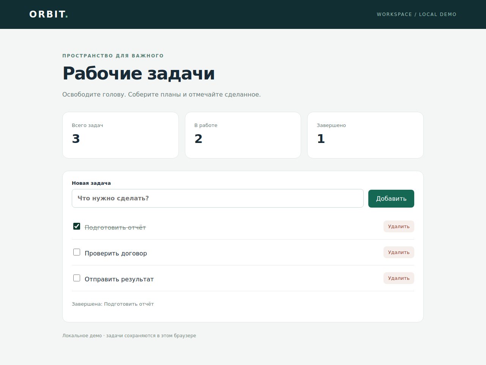

# Browser Agent

**Задача текстом → решения модели → действия в видимом браузере → проверяемый результат.**

Python · Playwright · OpenAI / Anthropic / Gemini / xAI / DeepSeek / OpenRouter · Rich

Универсальный прототип для тестового задания: у агента нет сценариев конкретных сайтов, заранее заданных маршрутов или селекторов сервисов. Он исследует страницу через текст, дерево доступности, DOM и скриншоты. Красивый терминал показывает шаги и аргументы, полный журнал сохраняется отдельно.

## Версия 0.9 — переработанный цикл действий

Модель вызывает `click_element(element_id)`, `type_text(element_id, text)`, `press_key`,
`select_option`, `check_element` и `uncheck_element`. Версии наблюдений контролирует
исполнитель. Успешные одинаковые действия (например, три добавления задач) не считаются
зацикливанием. После пяти ошибок без успешного действия агент останавливается;
промежуточные observe не сбрасывают этот счётчик.

Начальное наблюдение выполняется и без изображений. После действия или ошибки состояние
читается автоматически; неудачное действие автоматически не повторяется. Перед завершением
нужен verify и свидетельства результата, в том числе в DOM-only режиме.

Проверяется идентичность выбранного узла, его подпись, состояние, значения полей в его
форме, контекст строки/формы/диалога и наличие модальных окон. Изменение отдельного счётчика
или часов вне этого контекста не блокирует действие. Элементы не переназначаются между
решением модели и исполнением. Скрипты и стили сайта при чтении не удаляются.

Ограничение: это эвристика локального контекста, не полная проверка бизнес-смысла страницы.
Изменение цены или условий вне выбранного контекста может не блокировать действие.
Динамика внутри самой формы всё ещё может потребовать нового наблюдения. Playwright
проверяет доступность элемента при выполнении; DOM и скриншот не атомарны.

Обновление с 0.8/0.8.1: остановите процесс и замените **всю папку agent** из архива.
Не меняйте свои `.env`, `.venv` и `.profile`. Замена только browser.py для этой версии
недостаточна: изменились инструменты и исполнитель. После запуска баннер показывает 0.9.

## OpenRouter — запуск версии 0.8

Мастер `--setup` теперь предназначен для OpenRouter. Он запрашивает скрытый ключ, режим скриншотов и предлагает актуальные бесплатные модели с tools (и изображениями в визуальном режиме). Enter при выборе модели устанавливает `openrouter/free` — бесплатный маршрутизатор OpenRouter. Он выбирает модели по возможностям запроса; конкретная модель может меняться. Это не отменяет лимиты и не гарантирует качество выполнения задачи. Платные модели автоматически не выбираются.

```powershell
python -m agent.cli --setup
python -m agent.cli --check
python -m agent.cli
```

`python -m agent.cli --models` — показать каталог без отправки ключа или запроса к LLM. `--no-vision --models` включает текстовые модели с tools. При недоступности каталога мастер допускает ручной ID или бесплатный маршрутизатор. Ручной ID может быть платным: проверяйте его стоимость отдельно.

Файл `.env` имеет приоритет над одноимёнными переменными окружения — исправления настроек больше не перекрываются старым значением AGENT_PROVIDER из PyCharm. Значения, отсутствующие в файле, берутся из окружения.

При 429 выводятся имя провайдера и распознанная категория причины из metadata, без публикации сырого ответа. Если сервис не сообщил причину, программа прямо говорит об этом. Retry-After до 30 секунд учитывается при повторе (всего максимум 3 попытки). При неизвестном или большем ожидании управление возвращается пользователю; автоматического перебора моделей и обхода квот нет.

Документация: [Free Router](https://openrouter.ai/openrouter/free), [ошибки](https://openrouter.ai/docs/api_reference/errors-and-debugging), [каталог](https://openrouter.ai/docs/api/api-reference/models/get-models).

## Другие подключения (сохранены для ручной настройки)

```powershell
python -m agent.cli --setup
python -m agent.cli --check
python -m agent.cli
```

Другие провайдеры настраиваются вручную в `.env`; мастер версии 0.8 ориентирован на OpenRouter. Настройки сохраняются в `.env` рядом с проектом. Существующие остальные настройки сохраняются. Команда `--check` отправляет два запроса: проверяет вызов инструмента, изображение (если включено) и ответ после результата инструмента. Это расходует квоту выбранного API. Успех проверки не гарантирует выполнение произвольной браузерной задачи.

| AGENT_PROVIDER | Ключ | Подключение |
|---|---|---|
| openai | OPENAI_API_KEY | Прямой OpenAI Chat Completions |
| anthropic | ANTHROPIC_API_KEY | Прямой Anthropic Messages |
| gemini | GEMINI_API_KEY | Gemini OpenAI-compatible API |
| xai | XAI_API_KEY | Прямой xAI (Grok) |
| deepseek | DEEPSEEK_API_KEY | Прямой DeepSeek |
| openrouter | OPENROUTER_API_KEY | OpenRouter |
| compatible | AGENT_API_KEY | Свой Chat Completions endpoint; нужен AGENT_BASE_URL |

Для локального сервера без авторизации укажите непустое фиктивное значение AGENT_API_KEY. HTTP разрешён только для loopback. Для остальных подключений используется HTTPS. Модель выбирается явно: автоматического перехода на платную модель нет.

Нужна модель с поддержкой tools. Для скриншотов дополнительно нужна поддержка изображений именно выбранной моделью. Для текстовой модели укажите `AGENT_VISION=false` или `--no-vision`: агент использует DOM и дерево доступности. Лимиты: `AGENT_MAX_TOKENS=4096`, `AGENT_TIMEOUT=90` секунд. Reasoning-модели могут требовать больший лимит ответа. Отдельные провайдеры и модели могут иметь дополнительные ограничения; используйте проверку подключения.

Скриншоты сжаты в JPEG (качество 75); в истории остаётся последний снимок. Текстовая история по-прежнему ограничена и сокращается сводкой. При смене модели через `/reload` история очищается для совместимости протоколов, браузер остаётся открытым.

## Чат в терминале

```powershell
python -m agent.cli --url http://127.0.0.1:8765
```

После `Вы ›` пишите обычным текстом: задачу, вопрос или уточнение. После ответа/ошибки приглашение появится снова; Chromium остаётся открытым. История и заметки сохраняются между сообщениями в рамках процесса. `--task` задаёт первое сообщение, после него тоже открывается чат. Обычные вопросы используют `reply`, выполнение действий — `finish` с проверкой результата.

| Команда | Действие |
|---|---|
| `/help` | Список команд |
| `/check` | Двухшаговая проверка API |
| `/status` | Модель и URL активной страницы |
| `/reload` | Перечитать `.env`, применить новую модель без закрытия браузера |
| `/retry` | Продолжить последнюю задачу с проверкой уже выполненных действий |
| `/new` | Очистить память чата, сохранив браузер и вход |
| `/exit` | Закрыть сессию и финализировать видео |

`/reload` явно применяет значения файла поверх окружения текущего процесса. Если настройки некорректны, текущий объект модели сохраняется. Исправьте файл и повторите `/reload`.

Сообщения вводятся **после ответа агента**; параллельный ввод во время выполнения не реализован. Ctrl+C завершает процесс. Для одиночного запуска используйте `--once`; `--headless` тоже выполняет только одну задачу. Терминал показывает ожидание ответа модели.

Ошибка API больше не означает закрытие чата. Выводится `error.message` из ответа сервиса (с удалением ключа), без сырых metadata. Блокировка провайдера/лимит/недоступная бесплатная модель всё равно требуют решения на стороне подключения. Из запроса удалён необязательный `parallel_tool_calls`, чтобы не исключать провайдера только из-за отсутствия этого параметра. Проверка совместимости остальных параметров сохранена; несколько действий в одном ответе по-прежнему отклоняются агентом.

Каждое сообщение-задача имеет отдельную папку `runs/<session>/task-NNN/` с отчётом и журналом. Видео при `--record` относится ко всей сессии. История не восстанавливается после перезапуска приложения.

## Быстрый старт — Windows / PowerShell

Из распакованной папки `browser-agent`. Если `.venv` уже создана и активна, пропустите первые две команды — пересоздавать активное окружение не нужно:

```powershell
py -m venv .venv
.\.venv\Scripts\Activate.ps1
python -m pip install -r requirements.txt
python -m playwright install chromium
python -m agent.cli --setup
python -m agent.cli --check
```

Если предпочитаете ручную настройку, пример `.env` для OpenRouter:

```dotenv
AGENT_PROVIDER=openrouter
OPENROUTER_API_KEY=your-key
AGENT_MODEL=your-model-id
OPENROUTER_BASE_URL=https://openrouter.ai/api/v1
```

Модель должна поддерживать tools (function calling) и image input. Бесплатность не гарантирует наличие этих возможностей или доступность модели. Для ТЗ выбирайте Claude/OpenAI, если заказчик не согласовал другую модель. ID копируйте целиком, включая префикс провайдера; не добавляйте обратную косую черту перед `:free`. URL пишите обычным текстом, без Markdown.

Для прямого Anthropic API:

```dotenv
AGENT_PROVIDER=anthropic
ANTHROPIC_API_KEY=your-key
AGENT_MODEL=your-claude-model-id
ANTHROPIC_BASE_URL=https://api.anthropic.com
```

`.env` загружается автоматически. Значения в файле имеют приоритет над окружением. Другой файл можно передать через `--env-file`. Секреты не нужно отправлять в чат или добавлять в Git.

```powershell
python -m agent.cli
```

Откроется Chromium и появится приглашение ввести задачу. По умолчанию браузер видимый. Для Linux/macOS активация окружения: `source .venv/bin/activate`.

## Ручной вход и сохранение сессии

```powershell
python -m agent.cli --login --url https://example.com
```

Замените URL адресом нужного сервиса, войдите вручную и нажмите Enter в терминале. Следующий запуск использует тот же каталог `.profile`: cookies и local storage сохраняются. Не запускайте два процесса с одним профилем одновременно. `--profile` позволяет выбрать отдельный профиль.



## Демо за минуту

Первый терминал:

```powershell
python -m http.server 8765 --bind 127.0.0.1 --directory demo
```

Второй терминал:

```powershell
python -m agent.cli --url http://127.0.0.1:8765 --task "Создай задачи: подготовить отчёт, проверить договор, отправить результат. Отметь подготовку отчёта выполненной. Проверь, что всего три задачи и одна завершена." --record
```

Локальная доска Orbit сохраняет задачи в браузере. Для повторного чистого прогона используйте новый `--profile .profile-demo2`. Сценарий выше — задача пользователя для проверки, а не зашитая последовательность действий. Код агента не импортирует и не знает структуру демо.

Это проверка базового цикла. Для финальной сдачи нужен многошаговый сценарий на реальном сервисе, например исследование нескольких вакансий с итоговым сравнением. На видео покажите браузер и терминал одновременно. `--record` записывает **только браузер**, поэтому для финального ролика понадобится запись экрана.

## Что видно в терминале

- Баннер модели и профиля.
- Номер шага, инструмент и его аргументы.
- Короткие результаты инструментов и сообщения об ошибках.
- Итоговый статус, объяснение и свидетельства результата.

`--json-logs` переключает события в машинный JSON-формат (служебные приглашения CLI остаются обычным текстом). Rich не интерпретирует текст сайтов как разметку терминала.

## Архитектура

| Модуль | Ответственность |
|---|---|
| `cli.py` | Настройки, persistent browser, ручной вход, запуск и запись |
| `model.py` | Anthropic Messages и адаптеры прямых Chat Completions API, повторы временных ошибок |
| `runner.py` | Цикл инструментов, память, восстановление, отчёт |
| `browser.py` | Наблюдения, действия, вкладки, iframe и скриншоты |
| `tools.py` | JSON Schema инструментов и валидация аргументов |
| `ui.py` | Читаемый вывод терминала |

За один ответ разрешён один инструмент. После изменения страницы агент должен заново наблюдать её и проверить результат. Версия наблюдения, привязка к iframe и проверка состояния страницы помогают обнаружить устаревшую цель. При таймауте модель получает указание проверить фактический результат до повтора отправки.

### Управление контекстом

В модель передаются фрагменты текста и ARIA-дерева по 14 000 символов на канал, а не полный HTML. `offset` и `next_offset` позволяют читать продолжение. `inspect` возвращает до 40 элементов. При превышении эвристического бюджета истории выполняется суммаризация; исходная задача и заметки `remember` сохраняются. Скриншоты учитываются отдельным приблизительным весом.

Бюджет оценивается по символам, **это не точный токенизатор**. Playwright извлекает текст и дерево локально целиком, затем обрезает их перед отправкой. Очень большие и постоянно меняющиеся страницы могут требовать дальнейшей оптимизации.

### Продвинутый паттерн

Реализовано восстановление после ошибок: сообщения об ошибках возвращаются модели, неоднозначные цели отклоняются, повторные действия ограничиваются, после пяти последовательных ошибок выполнение останавливается. Сбой API также сохраняет `blocked`-отчёт. Для ТЗ достаточно одного паттерна; отдельные sub-agent и полноценный security layer здесь не заявляются.

### Границы безопасности и надёжности

Текст страниц объявлен недоверенными данными в системном промпте. Модель должна запрашивать недостающую информацию и ручной вход, останавливаться перед оплатой, не удалять данные безвозвратно. Это **инструкции модели, не независимый программный шлюз подтверждений**. Ввод в password-поле через `fill` отклоняется, но это не исчерпывающая защита всех способов ввода.

JavaScript-диалоги автоматически отклоняются; сайты с обязательным `confirm()` могут потребовать ручного участия. CAPTCHA и ограничения доступа не обходятся. Версия DOM снижает риск устаревшей цели, но не делает наблюдение и клик атомарными; значения canvas не покрываются проверкой DOM. `finish` проверяет наличие наблюдения и свидетельств, но смысл результата оценивает модель.

## Результаты

Каждый запуск создаёт `runs/<UTC-время>/`:

- `task-NNN/events.jsonl` — полный журнал событий (может содержать приватные данные страниц и введённый текст).
- `task-NNN/result.json` — статус `completed`, `partial`, `blocked` или `answered`, итог, свидетельства и расход токенов.
- `video/` — видеозапись при `--record`, финализируется при закрытии браузера.

Код завершения одиночного запуска: `0` — completed/answered/ручной вход, `2` — partial/blocked, `1` — ошибка запуска. Интерактивный /exit возвращает 0. `Ctrl+C` прерывает выполнение; итоговый JSON при прерывании не гарантируется.

## Проверка

В `requirements.txt` закреплена проверенная версия Playwright 1.51.0. Ограничение загрузки новой версии и порядок обновления описаны в `VALIDATION.md`; перед работой с личными аккаунтами обновите браузер и повторите тесты.

```powershell
python -m unittest discover -s tests -v
```

Тесты браузера используют настоящий Chromium headless. Тесты оркестрации используют подставную модель и не доказывают качество решений Claude. Фактические результаты текущей проверки — в `VALIDATION.md`, соответствие заданию — в `AUDIT.md`.

## Подготовка к сдаче

1. Настроить именно Claude: совместимость прокси с Anthropic API не доказывает использование Claude. GLM в инструкции ТЗ предложен для инструмента разработки; для самого агента ТЗ требует Claude или OpenAI.
2. Выполнить полноценный сценарий на реальном сервисе и проверить результат.
3. Записать экран с терминалом и браузером.
4. Опубликовать репозиторий без `.env`, `.profile*`, `runs/`, виртуального окружения и приватных журналов.
5. Отправить ссылку на репозиторий и короткое видео.

## Источники технических решений

- [Playwright: persistent context](https://playwright.dev/python/docs/api/class-browsertype#browser-type-launch-persistent-context)
- [Playwright: ARIA snapshots](https://playwright.dev/python/docs/aria-snapshots)

## Обновление существующей установки

Распакуйте архив, замените содержимое папки проекта новыми файлами. Ваши `.env`, `.profile` и `.venv` в архив не входят. В активном окружении выполните `python -m pip install -r requirements.txt`. Отредактируйте существующий `.env` по примеру выше, затем выполните `python -m agent.cli` из папки, где лежит `requirements.txt`.

Ошибка 401: ключ; 402: баланс; 404: ID модели; 429: лимит запросов. Ошибка 400 может означать отсутствие поддержки tools/images у модели. Клиент не подменяет выбранную модель автоматически.

OpenRouter: [запросы и авторизация](https://openrouter.ai/docs/quickstart), [изображения](https://openrouter.ai/docs/guides/overview/multimodal/image-understanding). Картинка из tool-result отправляется отдельным пользовательским сообщением после текстового ответа инструмента; непрозрачные reasoning_details сохраняются для следующего хода.

## Context Builder и зрение (0.5)

Основная навигация — DOM/ARIA. `observe` добавляет заголовок, активную вкладку, координаты прокрутки, размер viewport, до 80 видимых элементов с короткими ID и до 20 записей о различиях. Таблица элементов относится к выбранному frame; заголовок/URL — к активной странице. Текст/ARIA ограничены фрагментами по 14 000 символов.

Действие по ID: `click_element(element_id=3)`. Используется последний список элементов выбранного frame; версии ведутся внутри исполнителя. Если цели нет в видимой части списка, прокрутите страницу или вызовите observe с нужным frame. ID не пишутся в DOM-атрибуты. Короткоживущий ElementHandle привязан к конкретному узлу и освобождается после действия.

Скриншот автоматически отправляется:

- Перед первым решением модели.
- После перехода или переключения вкладки.
- При изменении списка элементов, диалогов, прокрутки, геометрии или существенного объёма текста (порог 400 отличающихся символов).
- При наличии видимого canvas/video или первом наблюдении после ошибки.
- По явному запросу `screenshot` и при финальной проверке `verify`.

Обычный ввод и небольшое изменение текста могут обойтись без картинки. DOM-наблюдение после действия всё равно обновляется. Это эвристика, а не полное определение визуальной значимости: CSS-анимации, изменения картинок и сложные shadow DOM могут потребовать явного screenshot/role-локатора. Имена и роли в коротком списке приблизительные; ARIA-дерево сохраняется как дополнительный источник.

В визуальном режиме `completed` требует отдельного `verify`: агент получает свежую страницу и снимок, затем в следующем ходе должен оценить их и вызвать `finish` с актуальной версией. Код проверяет наличие проверки, но не может доказать корректность рассуждения модели. При недоступном снимке можно сообщить partial/blocked.

История содержит максимум один актуальный скриншот; старые изображения удаляются, исходная задача и заметки сохраняются через суммаризацию. Перед действием состояние DOM проверяется локально, без постоянных вызовов LLM. Наблюдение и снимок не атомарны. Координатные клики не реализованы.

Отключение автоматических картинок: `python -m agent.cli --no-vision`. Явный screenshot остаётся доступен.
